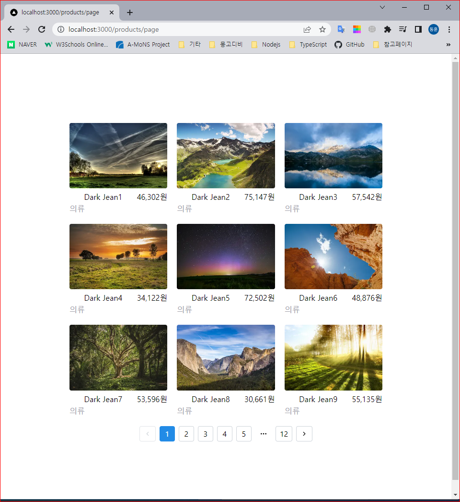

## part5 ch03 03.상품 목록 구현

> 목록(리스트)은?  
> 같은 위계의 데이터를 나열하는 것  
> 웹서비스에서 가장 많이 쓰이는 구현 대상일 듯

> 커머스  
> 상품 목록 / 찜하기 목록 / 구매 내역 / 상품평 목록 / 검색 결과 등  
> 다른 서비스  
> 블로그 글 목록 / 뉴스 목록 / 댓글 목록 / 웹툰 목록 / 웹툰 회차 목록  
> 강의 목록 / 강의 회차 목록…  
> 모든 게 다 목록

> 리스트 구현의 핵심은?  
> 더보기 로직  
> DB에 들어있는 모든 내역을 한번에 조회하고 보여주는 것은 비효율  
> 적절하게 나눠서 조회하고 보여줘야 한다.

> 일반적으로 page 개념을 활용 페이지당 n개의 목록을 조회하고 보여주는 식

> 보여지는 UI로는
>
> - pagination(페이징 처리)
> - load more button(더보기)
> - Infinite scroll(무한 스크롤)

## 실습

### 1. 초기 데이터 100개 생성

1.  ts-node 설치  
    `$yarn add -D ts-node`
2.  tsconfig.json 셋팅

```javascript
{
  "compilerOptions": {
    ...
    ...
    ...
  },
  ...
  ...
  "ts-node": {
    "compilerOptions": {
      "module": "commonjs"
    }
  }
}
```

3.  prisma 디렉토리 products.ts 파일 생성

```javascript
import { PrismaClient, Prisma } from '@prisma/client'

const prisma = new PrismaClient()

const productData: Prisma.productsCreateInput[] = Array.apply(
  null,
  Array(100)
).map((_, index) => ({
  name: `Dark Jean${index + 1}`,
  contents: `{\"blocks\":[{\"key\":\"au0ft\",\"text\":\"This is a blue-${
    index + 1
  }!!\",\"type\":\"unstyled\",\"depth\":0,
        \"inlineStyleRanges\":[{\"offset\":0,\"length\":16,\"style\":\"BOLD\"}],
        \"entityRanges\":[],\"data\":{}}],\"entityMap\":{}}`,
  category_id: 1,
  image_url: `https://raw.githubusercontent.com/xiaolin/react-image-gallery/master/static/${
    index + (1 % 10) === 0 ? 10 : (index + 1) % 10
  }.jpg`,
  price: Math.floor(Math.random() * (100000 - 20000) + 20000),
}))

async function main() {
  await prisma.products.deleteMany({})

  for (const p of productData) {
    const product = await prisma.products.create({
      data: p,
    })
    console.log(`Created id: ${product.id}`)
  }
}

main()
  .then(async () => {
    await prisma.$disconnect()
  })
  .catch(async (e) => {
    console.log(e)
    await prisma.$disconnect()
    // process.exit(1)
  })
```

4. PlaneScale DB에서 products 테이블에 price 컬럼 추가
   ```sql
   ALTER TABLE products ADD price INT NOT NULL DEFAULT 20000;
   ```
5. schema.prisma 파일 price 스키마 추가

```javascript
...
...

model products {
  id Int @id @default(autoincrement())
  name String
  image_url String?
  category_id Int
  contents String?
  price Int  /** Int 타입의 price 스키마 추가*/
  createdAt DateTime @default(now())

  @@index([category_id])
}

```

6. ts-node 실행
   `$ yarn ts-node prisma/products.ts`

### 2. 더보기 버튼 활용 데이터 가져오기

1. pages/products 디렉토리에 indtx.tsx 파일 생성
   **index.tsx**

```javascript
import { products } from '@prisma/client'
import Image from 'next/image'
import { useState, useEffect, useCallback } from 'react'

const TAKE = 9
export default function Products() {
  const [skip, setSkip] = useState(0)
  const [products, setProducts] = useState<products[]>([])

  useEffect(() => {
    fetch(`/api/get-products?skip=0&take=${TAKE}`)
      .then((res) => res.json())
      .then((data) => setProducts(data.items))
  }, [])

  const getProducts = useCallback(() => {
    const next = skip + TAKE
    fetch(`/api/get-products?skip=${next}&take=${TAKE}`)
      .then((res) => res.json())
      .then((data) => {
        const list = products.concat(data.items)
        setProducts(list)
      })
    setSkip(next)
  }, [skip, products])

  return (
    <div className="px-36 mt-36 mb-36">
      {products && (
        <div className="grid grid-cols-3 gap-5">
          {products.map((item) => (
            <div key={item.id}>
              <Image
                className="rounded"
                alt={item.name ?? ''}
                src={item.image_url ?? ''}
                width={300}
                height={200}
                placeholder="blur"
                blurDataURL="data:image/png;base64,iVBORw0KGgoAAAANSUhEUgAAAAEAAAABCAYAAAAfFcSJAAAADUlEQVR42mP8z8BQDwAEhQGAhKmMIQAAAABJRU5ErkJggg=="
                /** https://png-pixel.com/ 경로 에서 blur 데이터 가지고와 blur 처리*/
              />
              <div className="flex">
                <span className="ml-auto">{item.name}</span>
                <span className="ml-auto">
                  {item.price.toLocaleString('ko-KR')}원
                </span>
              </div>
              <span className="text-zinc-400">
                {item.category_id === 1 && '의류'}
              </span>
            </div>
          ))}
        </div>
      )}
      <button
        className="w-full rounded mt-20 bg-zinc-200 p-4"
        onClick={getProducts}
      >
        더보기
      </button>
    </div>
  )
}

```

2. api/get-products.ts API 수정

**get-products.ts**

- skip, take 쿼리 추가

```javascript
import type { NextApiRequest, NextApiResponse } from 'next'
import { PrismaClient } from '@prisma/client'

const prisma = new PrismaClient()

async function getProducts(skip: number, take: number) {
  try {
    const response = await prisma.products.findMany({
      skip: skip,
      take: take,
    })
    console.log(response)
    return response
  } catch (error) {
    console.error(JSON.stringify(error))
  }
}

type Data = {
  items?: any
  message: string
}

export default async function handler(
  req: NextApiRequest,
  res: NextApiResponse<Data>
) {
  const { skip, take } = req.query

  if (skip == null || take == null) {
    return res.status(400).json({ message: 'No skip or take' })
  }
  try {
    const products = await getProducts(Number(skip), Number(take))
    res.status(200).json({ items: products, message: `Success` })
  } catch (error) {
    res.status(400).json({ message: `Failed` })
  }
}

```

<<<<<<< HEAD
### 3. Pagenation 활용 데이터 가져오기

1.  mantine 라이브러리 설치
    `$ yarn add @mantine/core @mantine/hooks`

2.  products/page.tsx 컴포넌트 생성

```javascript
import { products } from '@prisma/client'
import Image from 'next/image'
import { useState, useEffect, useCallback } from 'react'
import { Pagination } from '@mantine/core'

const TAKE = 9
export default function Products() {
  const [activePage, setPage] = useState(1)
  const [total, setTotal] = useState(0)
  const [products, setProducts] = useState<products[]>([])

  useEffect(() => {
    fetch(`/api/get-products-count`)
      .then((res) => res.json())
      .then((data) => setTotal(Math.ceil(data.items / 9)))
    fetch(`/api/get-products?skip=0&take=${TAKE}`)
      .then((res) => res.json())
      .then((data) => setProducts(data.items))
  }, [])

  useEffect(() => {
    const skip = TAKE * (activePage - 1)
    fetch(`/api/get-products?skip=${skip}&take=${TAKE}`)
      .then((res) => res.json())
      .then((data) => setProducts(data.items))
  }, [activePage])

  return (
    <div className="px-36 mt-36 mb-36">
      {products && (
        <div className="grid grid-cols-3 gap-5">
          {products.map((item) => (
            <div key={item.id}>
              <Image
                className="rounded"
                alt={item.name ?? ''}
                src={item.image_url ?? ''}
                width={300}
                height={200}
                placeholder="blur"
                blurDataURL="data:image/png;base64,iVBORw0KGgoAAAANSUhEUgAAAAEAAAABCAYAAAAfFcSJAAAADUlEQVR42mP8z8BQDwAEhQGAhKmMIQAAAABJRU5ErkJggg=="
              />
              <div className="flex">
                <span className="ml-auto">{item.name}</span>
                <span className="ml-auto">
                  {item.price.toLocaleString('ko-KR')}원
                </span>
              </div>
              <span className="text-zinc-400">
                {item.category_id === 1 && '의류'}
              </span>
            </div>
          ))}
        </div>
      )}
      <div className="w-full flex mt-5">
        <Pagination
          className="m-auto"
          page={activePage}
          onChange={setPage}
          total={total}
        />
      </div>
    </div>
  )
}
```

3.  get-products-count.ts API 파일 생성

```javascript
import { products } from '@prisma/client'
import Image from 'next/image'
import { useState, useEffect, useCallback } from 'react'
import { Pagination } from '@mantine/core'

const TAKE = 9
export default function Products() {
  const [activePage, setPage] = useState(1)
  const [total, setTotal] = useState(0)
  const [products, setProducts] = useState<products[]>([])

  useEffect(() => {
    fetch(`/api/get-products-count`)
      .then((res) => res.json())
      .then((data) => setTotal(Math.ceil(data.items / 9)))
    fetch(`/api/get-products?skip=0&take=${TAKE}`)
      .then((res) => res.json())
      .then((data) => setProducts(data.items))
  }, [])

  useEffect(() => {
    const skip = TAKE * (activePage - 1)
    fetch(`/api/get-products?skip=${skip}&take=${TAKE}`)
      .then((res) => res.json())
      .then((data) => setProducts(data.items))
  }, [activePage])

  return (
    <div className="px-36 mt-36 mb-36">
      {products && (
        <div className="grid grid-cols-3 gap-5">
          {products.map((item) => (
            <div key={item.id}>
              <Image
                className="rounded"
                alt={item.name ?? ''}
                src={item.image_url ?? ''}
                width={300}
                height={200}
                placeholder="blur"
                blurDataURL="data:image/png;base64,iVBORw0KGgoAAAANSUhEUgAAAAEAAAABCAYAAAAfFcSJAAAADUlEQVR42mP8z8BQDwAEhQGAhKmMIQAAAABJRU5ErkJggg=="
              />
              <div className="flex">
                <span className="ml-auto">{item.name}</span>
                <span className="ml-auto">
                  {item.price.toLocaleString('ko-KR')}원
                </span>
              </div>
              <span className="text-zinc-400">
                {item.category_id === 1 && '의류'}
              </span>
            </div>
          ))}
        </div>
      )}
      <div className="w-full flex mt-5">
        <Pagination
          className="m-auto"
          page={activePage}
          onChange={setPage}
          total={total}
        />
      </div>
    </div>
  )
}

```

4. 결과  
   http://localhost:3000/products/page



> ## [참고] **Infinite scroll(무한스크롤)**
>
> Infinite scroll 은 스크롤이 하단에 도달했는지 판단이 필요
> 그 판단을 위해
> scroll event를 활용할 수 도 있고,  
> intersection observer를 활용할 수도 있다.  
> scroll event 를 활용하면 잦은 호출을 방지하기 위해 throttle 을 적용하거나  
> 무한 스크롤을 했을 경우,
> React 에서 한 화면에 너무 많은 컴포넌트를 들고 있는 경우가 발생
> 로드한 컴포넌트가 늘어날수록 느려지는 현상이 발생할 수 있음
> 그럴때는 Virtual Scroll(가상 스크롤)을 활용할 수 있음
> n개의 컴포넌트만 그리고 이 요소를 재활용 할 수 있도록 해줌
> requestAnimationFrame(rAF)를 활용하는 것이 좋다.

## 결과

=======
## 결과

- 접속 주소: http://localhost:3000/products/2/edit

>>>>>>> c57318fa0e25ec613f07e2e4ac93324af748294e
## 이슈 및 에러 경험

## 참고

<<<<<<< HEAD
[prisma pagenation] https://www.prisma.io/docs/concepts/components/prisma-client/pagination

[blurDataUrl 생성] https://png-pixel.com/

[pagenation 라이브러리] https://mantine.dev/core/pagination/

[참고]

=======
```

```
>>>>>>> c57318fa0e25ec613f07e2e4ac93324af748294e
